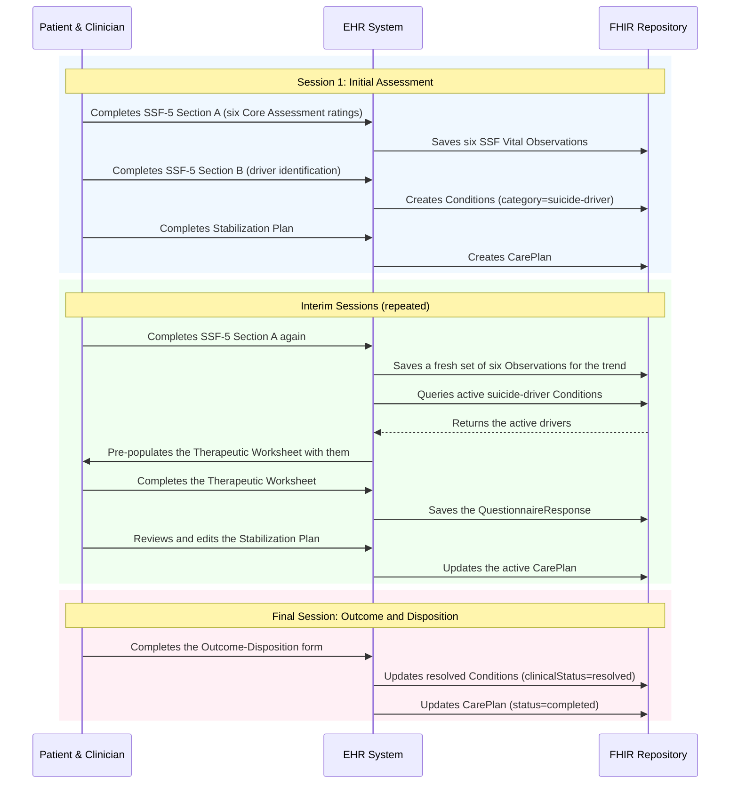

# CAMS — Collaborative Assessment and Management of Suicidality

## Provenance

CAMS is a therapeutic framework rather than a single instrument: a clinician and
patient assess suicidality collaboratively, name the specific *drivers* of it,
and work them down over a series of sessions. Its assessment instrument is the
**Suicide Status Form (SSF)**.

| | |
|---|---|
| **Author** | David A. Jobes, PhD |
| **Distributed by** | CAMS-care, LLC and Guilford Press |
| **Licensing** | ⚠️ **Commercial.** Use requires training and a license from CAMS-care, and the SSF must not be reproduced without that agreement. The status and terms are on each `AdministerCAMS*` ActivityDefinition. **No licensing-audit memo is on file** for CAMS under [#64](https://github.com/SPiER-Project/adoption-guide/issues/64), so the terms recorded there come from the notice on the SPiER Questionnaires and have **not** been verified against CAMS-care's current published terms. |

## What's in this folder

| File | What it is |
|---|---|
| `cams-ssf5-section-a.json` | SSF-5 Section A — the patient's six Core Assessment ratings. Also the form used for every interim-session re-rating |
| `cams-ssf5-section-b.json` | SSF-5 Section B — the clinician's driver identification |
| `cams-therapeutic-worksheet.json` | The Therapeutic Worksheet used between sessions |
| `cams-stabilization-plan.json` | The Stabilization Plan, reviewed at the start of every session |
| `cams-ssf5-outcome-disposition.json` | The final-session outcome and disposition form |
| `Stabilization_CarePlan_Template.json` | A hand-authored CarePlan template, kept for reference; the conformance target is the `SPiERCAMSStabilizationPlan` profile |
| `references/build-kit/` | The fillable SSF-5, Therapeutic Worksheet and Stabilization Support Plan PDFs, plus the Guilford/CAMS-care content-distribution agreement |
| `references/specs/` | The CAMS EHR build specs and the EHR→dashboard translation workbook |
| `references/training-transcripts/` | Transcripts of the CAMS clinical demonstration, introduction and conclusion training sessions |
| `references/focus-groups/` | The CAMS focus-group question set |

Everything about the FHIR shapes is defined in
[`ig/input/fsh/cams.fsh`](../../ig/input/fsh/cams.fsh) and rendered in the
published IG: the SSF measure, driver-category, driver-type, disposition and
CarePlan-section CodeSystems; the `SPiERCAMSSSFVital`,
`SPiERCAMSSuicideDriver`, `SPiERCAMSStabilizationPlan`,
`SPiERCAMSTherapeuticWorksheet` and `SPiERCAMSOutcomeDisposition` profiles; the
six ActivityDefinitions with their stage membership and licensing; and the
example instances.

⚠️ **The driver category systems are SPiER-local.** Earlier revisions of this
file and of the demo mapper named `http://cams-care.com/…` URLs, which are not
resolvable terminology ([#265](https://github.com/SPiER-Project/adoption-guide/issues/265)).
Both live systems are declared in the FSH as named slices on
`Condition.category` in the `SPiERCAMSSuicideDriver` profile.

## The episode, not the form — how the pieces wire together

The profiles above define each resource's shape. What they do not say is how the
resources relate across a course of CAMS treatment, which is the thing CAMS
implementers get wrong: **CAMS is an episode, and every artifact here is
longitudinal.**

**Session 1.** Section A produces six separate `SPiERCAMSSSFVital` Observations
— one per SSF measure, `valueInteger` 1–5 — deliberately not one composite, so
an EHR can chart each measure over time. Section B's driver answers become
`SPiERCAMSSuicideDriver` `Condition` resources with
`clinicalStatus: active`. The Stabilization Plan becomes a CarePlan.

**Interim sessions.** Section A is re-administered each time
(`AdministerCAMSInterimSession`), producing a fresh set of six Observations for
the trend. Two behaviours are expected of the host and are stated nowhere else:

- **Pre-populate the Therapeutic Worksheet from the chart, not from memory.**
  Query the patient's active drivers (`Condition?category=suicide-driver&clinical-status=active`)
  and fill the worksheet's problem headers from them, so the worksheet tracks
  the drivers that were actually identified rather than asking the clinician to
  retype them.
- **Show the current Stabilization Plan and let it be edited.** Updates revise
  the active CarePlan rather than creating an unrelated one — it is a living
  document spanning the episode, not a per-session snapshot.

**Final session.** The Outcome-Disposition form records the disposition;
resolved drivers move to `clinicalStatus: resolved` and the CarePlan to
`status: completed`. `AdministerCAMSInterimSession` states the resolution
criterion CAMS uses: three consecutive interim sessions showing low overall
risk.

